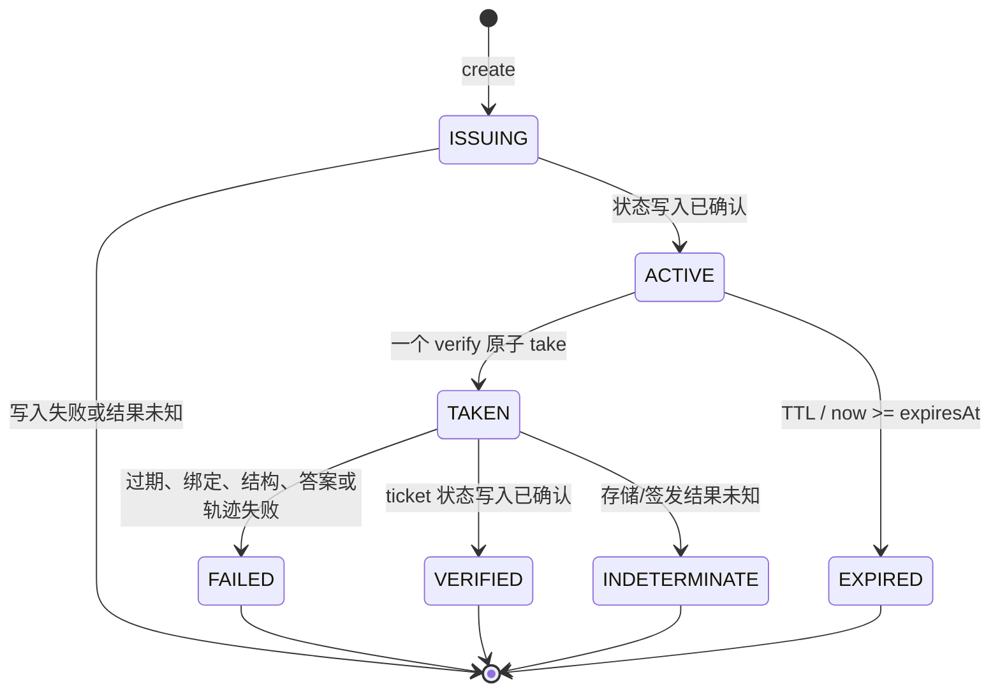
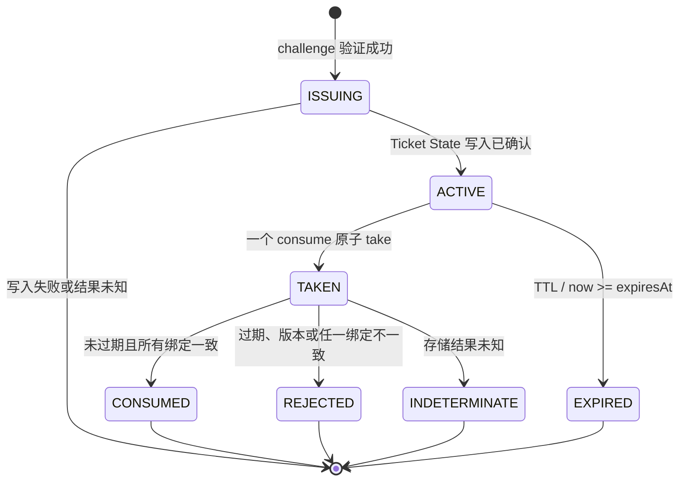

# ChalSense v0.1 协议与状态机

## 文档状态

- 状态：D-013～D-018、D-021～D-032 已批准的协议、状态存储与 Widget 基线；不是已发布 API，最终 HTTP 路径仍需在 `chalsense-server` 创建前评审。
- 范围：逻辑操作 `challenge.create`、`challenge.verify`、`verificationTicket.consume` 及其 Core 语义。
- 约束：D-011 要求嵌入式 Java API 和受信任 HTTP API 进入同一 Core 状态机；本文不固定最终 URL，Java 包名和 Maven/npm 坐标以 D-019～D-021 为准。
- 兼容性提示：核心状态机、字段语义、整数坐标与错误合并规则已获批准；verify/consume 机器向量冻结为 `docs/test-vectors/protocol-v1.json`，create 补充向量依 D-026 独立冻结为 `docs/test-vectors/challenge-create-v1.json`，状态 JSON 向量依 D-027 冻结为 `docs/test-vectors/state-json-v1.json`；全部 Java Core runner 均已通过。

标签含义沿用 `docs/threat-model.md`。D-001～D-032 均作为已批准前提；文中“建议”只表示尚未冻结为公开 HTTP 表面的实现细节，不得改变已批准安全语义。

## 术语

| 术语 | 定义 |
| --- | --- |
| challenge | 一次短时、单次尝试的验证题目及服务端状态 |
| verification attempt | 已通过传输层、调用方和大小前置检查，且可识别 `challengeId` 的一次 `challenge.verify` 调用 |
| `verificationTicket` | 验证成功后签发的短时 bearer credential；只能由业务后端通过 Core 统一消费 |
| consume | 原子取走状态，再校验过期和绑定；无论校验结果如何都不恢复 |
| `siteKey` | 可公开的站点配置标识，不是密钥 |
| `action` | 接入方定义且已注册的受保护动作，例如 `login` |
| `contextDigest` | 业务对不透明上下文计算的 32 字节摘要；ChalSense 只做绑定与相等比较 |
| public caller | 浏览器或其他不可信客户端，可创建/验证但不能消费 ticket |
| trusted caller | 通过进程内边界或服务端凭据认证的业务后端 |

## 统一编码规则（已批准）

1. 传输 JSON 使用 UTF-8，顶层必须为 object；不得有 BOM。
2. 字段名区分大小写。请求拒绝重复 object member、未知字段和类型不符；响应接收方必须忽略未知字段，以允许同版本内增加非安全关键响应元数据。
3. 所有协议整数必须处于 JSON/ECMAScript 安全整数范围 `[-9007199254740991, 9007199254740991]`；本协议当前定义的计数、坐标与毫秒值还受更小范围限制。拒绝小数、指数表示、`NaN`、`Infinity` 和数字字符串。
4. 标识和摘要采用无填充 Base64url（RFC 4648 URL-safe alphabet），拒绝 `=`、空白和非规范编码。
5. `challengeId` 固定为 16 字节 CSPRNG 随机值，编码为 22 字符无填充 Base64url。`verificationTicket` 固定为 32 字节 CSPRNG 随机值，编码为 43 字符无填充 Base64url；严格解码后对 32 个原始字节计算 `SHA-256`，Redis 查找 key 使用其小写十六进制摘要，不保存原始 ticket。
6. 时间使用 Unix epoch 毫秒整数；仅服务端时钟决定创建、签发和过期。客户端轨迹时间是相对毫秒且不可信。
7. `protocolVersion` 首版固定为字符串 `"1"`。不兼容字段或语义变化必须提升版本；不得依据 `User-Agent` 猜测协议。
8. `siteKey`、`action` 只允许 ASCII：`siteKey` 固定为 `^[A-Za-z0-9_-]{8,64}$`，`action` 固定为 `^[a-z][a-z0-9._-]{0,63}$`。
9. `contextDigest` 固定为 32 字节 Base64url；业务负责定义明文的规范序列化并计算摘要。低熵账号、手机号等值必须使用业务持有密钥的 HMAC-SHA-256 或等效构造，不能直接裸 SHA-256。ChalSense 不规定或接收业务明文。

## 通用安全前置检查

按以下顺序执行，避免未授权调用消耗合法状态，也避免已识别的验证尝试被重复利用：

1. TLS、HTTP 方法、Content-Type、压缩与请求体大小限制。
2. JSON 语法、重复字段和顶层结构检查。若无法可靠取得唯一标识，不产生状态变化。
3. 调用面认证：公开接口解析 `siteKey` 并执行精确 Origin 策略；受信任接口验证服务端凭据或进程内调用边界。
4. 公开限流和全局容量保护。被限流的请求不消费尚未取得的 challenge/ticket。
5. 校验标识的编码和固定长度。
6. 对 `challenge.verify` 或 `verificationTicket.consume` 执行原子 `take`。
7. 在已经取走的状态上进行协议版本、过期、请求语义、绑定和答案校验；任何结果都不恢复状态。

**建议理由：** 如果在原子 `take` 之前检查答案相关字段，攻击者可能利用不同错误反复探测；如果在认证和容量保护之前取走，跨站调用和无效大包更容易成为定向烧毁挑战的工具。

## `challenge.create`

### 请求草案

```json
{
  "protocolVersion": "1",
  "siteKey": "site_demo_01",
  "action": "login",
  "contextDigest": "AAAAAAAAAAAAAAAAAAAAAAAAAAAAAAAAAAAAAAAAAAA"
}
```

语义：

- `siteKey` 是公开配置定位符，服务端必须确认其启用、允许 `action`，并对浏览器调用执行允许 Origin 精确匹配。
- `contextDigest` 必须由业务为本次受保护动作生成；登录场景不得提交明文账号、密码或表单。
- 是否允许浏览器直接创建 challenge 属于部署策略；无论入口为何，Core 的状态内容与后续绑定一致。

### 成功响应草案

```json
{
  "protocolVersion": "1",
  "challengeId": "AAAAAAAAAAAAAAAAAAAAAA",
  "challengeType": "SLIDER_PUZZLE",
  "issuedAt": 1787356800000,
  "expiresAt": 1787356920000,
  "geometry": {
    "coordinateScale": 1000000,
    "logicalWidth": 320,
    "logicalHeight": 180,
    "pieceStartX": 62500,
    "pieceStartY": 388889,
    "pieceWidth": 156250,
    "pieceHeight": 277778
  },
  "resources": [
    {
      "role": "BACKGROUND",
      "url": "/chalsense/resources/example-bg",
      "mediaType": "image/webp",
      "pixelWidth": 640,
      "pixelHeight": 360
    },
    {
      "role": "PIECE",
      "url": "/chalsense/resources/example-piece",
      "mediaType": "image/png",
      "pixelWidth": 100,
      "pixelHeight": 100
    }
  ]
}
```

公开几何只用于一致渲染，不包含 `pieceTargetX`、答案、容差或内部策略。资源不是秘密，URL 泄露不得使其他 challenge 可通过。

### 创建原子性

- 生成器先产生完整状态，状态存储确认带 TTL 写入后才返回响应。
- 写入失败或确认结果未知时返回 `DEPENDENCY_UNAVAILABLE`，不得返回可用 `challengeId`。
- 只有 Store 明确返回 `ALREADY_EXISTS` 时才以新随机 ID 重试，Core 最多尝试 3 个 ID；明确失败不重试，结果未知尤其不得重试。冲突重试生成的临时资源必须由生成器或资源层按 challenge 生命周期清理。
- 响应传输失败时状态可以自然过期；不得以相同 ID 重建或覆盖。

## `challenge.verify`

### 请求草案

```json
{
  "protocolVersion": "1",
  "siteKey": "site_demo_01",
  "challengeId": "AAAAAAAAAAAAAAAAAAAAAA",
  "solution": {
    "finalPieceX": 593750,
    "track": [
      {"x": 0, "y": 0, "t": 0, "event": "START"},
      {"x": 210000, "y": 5556, "t": 120, "event": "MOVE"},
      {"x": 531250, "y": 0, "t": 420, "event": "END"}
    ]
  }
}
```

- 坐标采用 `coordinateScale = 1_000_000` 的整数规范化单位；完整换算见 `docs/coordinates.md`。
- `finalPieceX` 是拼图片左边缘相对背景宽度的位置，不是指针位置。它必须等于服务端公开 `pieceStartX` 加最终相对轨迹 `x`，允许最多 1 个规范化单位的取整差。
- `track[].x/y` 均相对真实按下点；不得假设从滑块中心按下。`t` 相对首点，单位毫秒。
- 固定限制：2～256 点、`t` 为 `0..30000` 且单调不递减；首点必须 `START` 且 `(x,y,t)=(0,0,0)`，末点必须 `END`，中间只能 `MOVE`。坐标绝对值不得超过 `2 * coordinateScale`。
- 轨迹结构有效不代表真人行为；启发式失败只能说明不符合当前规则。

### 成功响应草案

```json
{
  "protocolVersion": "1",
  "verificationTicket": "AAAAAAAAAAAAAAAAAAAAAAAAAAAAAAAAAAAAAAAAAAA",
  "issuedAt": 1787356801000,
  "expiresAt": 1787356861000
}
```

响应不得包含答案距离、容差、轨迹原因码或内部风险细节。Widget 的成功事件只表明收到 ticket；业务动作尚未获准。

### 验证步骤

1. 完成通用前置检查并按 `siteKey` 定位 challenge key。
2. 原子 `take` Challenge State。未找到时统一返回 `CHALLENGE_UNAVAILABLE`，不公开区分不存在、过期、已失败、已成功或重放。
3. 若存储调用超时或结果未知，返回 `DEPENDENCY_UNAVAILABLE`；同一 challenge 不得自动重试。
4. 使用 Core 取得状态后的服务端时间检查 `expiresAt`；到期条件为 `now >= expiresAt`。对外统一返回 `CHALLENGE_UNAVAILABLE`，与 TTL 已删除或重放相同。
5. 检查状态与请求的 `protocolVersion`、`siteKey`，再验证结构、坐标终点、答案与轨迹启发式。
6. 任一检查失败返回 `VERIFICATION_FAILED`；内部可记录低基数原因码，但响应不泄露具体原因。
7. 成功时生成全新 ticket，先持久化 Ticket State，再返回。若持久化失败或结果未知，返回 `DEPENDENCY_UNAVAILABLE`，challenge 不恢复。

### Challenge 状态机



`TAKEN` 以后没有回到 `ACTIVE` 的路径。并发请求中最多一个进入 `TAKEN`，其余得到 `CHALLENGE_UNAVAILABLE`。

## `verificationTicket.consume`

该操作仅允许业务后端调用。嵌入式 Java API 可使用等价的强类型参数；独立服务通过受信任 HTTP API 暴露，但不得允许浏览器 CORS 调用。

### 请求草案

```json
{
  "protocolVersion": "1",
  "verificationTicket": "AAAAAAAAAAAAAAAAAAAAAAAAAAAAAAAAAAAAAAAAAAA",
  "siteKey": "site_demo_01",
  "action": "login",
  "contextDigest": "AAAAAAAAAAAAAAAAAAAAAAAAAAAAAAAAAAAAAAAAAAA"
}
```

### 成功响应草案

```json
{
  "protocolVersion": "1",
  "valid": true,
  "verifiedAt": 1787356801000,
  "consumedAt": 1787356802000
}
```

失败使用统一错误，不返回 `valid:false` 的可枚举细节。调用方只有收到成功响应才能把 ChalSense 视为“本次绑定验证已被消费”的信号；最终授权仍由业务决定。

### 消费步骤

1. 验证受信任调用方及其可访问的 `siteKey`，完成容量限制和 ticket 编码检查。
2. 严格 Base64url 解码 ticket，对所得 32 个原始字节计算 SHA-256 查找摘要，原子 `take` Ticket State。
3. 未找到统一返回 `TICKET_UNAVAILABLE`；不区分随机、过期、已消费或已吊销。
4. 存储结果未知返回 `DEPENDENCY_UNAVAILABLE`，不得以同一 ticket 自动重试。
5. 到期条件为 `now >= expiresAt`；到期对外统一返回 `TICKET_UNAVAILABLE`。未到期时精确校验 `protocolVersion`、`siteKey`、`action` 和 32 字节 `contextDigest`；字符串/字节比较不得提前泄露差异位置。
6. 任一失败返回 `TICKET_INVALID`，状态不恢复；全部通过才返回成功。

### Ticket 状态机



## 状态对象（内部稳定模型草案）

Redis Key、TTL 和二进制布局不是公开 API，但状态模型必须版本化并可迁移。

### Challenge State

| 字段 | 含义 |
| --- | --- |
| `storageVersion` | 内部序列化版本，与 `protocolVersion` 分离 |
| `protocolVersion` | 线协议主版本 |
| `challengeType` | v0.1 仅 `SLIDER_PUZZLE` |
| `challengeIdDigest` | 可选的诊断/完整性绑定，不保存原始 ID 到日志 |
| `siteKey`, `action`, `contextDigest` | 后续 ticket 继承的绑定 |
| `issuedAt`, `expiresAt` | 服务端 epoch ms |
| `geometry` | 服务端权威的规范化起点、目标、拼图片尺寸与 `tolerance`；公开响应由此派生但排除目标和容差 |
| `answerMaterial` | 若未来类型需要几何之外的答案材料，只保存验证所需最小值，不暴露给资源层或客户端；v0.1 滑块无需独立字段 |
| `policyVersion` | 生成与轨迹/容差策略版本，供回归和灰度，不由客户端指定 |

### Ticket State

| 字段 | 含义 |
| --- | --- |
| `storageVersion`, `protocolVersion` | 独立版本 |
| `siteKey`, `action`, `contextDigest` | 必须完整匹配的绑定 |
| `challengeType`, `policyVersion` | 审计与策略诊断 |
| `verifiedAt`, `issuedAt`, `expiresAt` | 服务端时间 |
| `ticketIdDigest` | 可选内部关联值，不等于返回给浏览器的 bearer token |

状态中不保存完整轨迹，除非未来经过单独的隐私与留存决策；默认验证完成即释放。

## HTTP 映射与错误模型（建议）

逻辑错误对象：

```json
{
  "protocolVersion": "1",
  "error": {
    "code": "CHALLENGE_UNAVAILABLE",
    "requestId": "01K..."
  }
}
```

| HTTP | `code` | 可重试语义 |
| --- | --- | --- |
| 400 | `INVALID_REQUEST` | 修正请求；若 challenge/ticket 已被 take，则原凭据不可重试 |
| 401/403 | `CALLER_UNAUTHORIZED` / `ORIGIN_NOT_ALLOWED` | 不自动重试；前置拒绝不消费状态 |
| 404 或 409 | `CHALLENGE_UNAVAILABLE` / `TICKET_UNAVAILABLE` | 必须创建新 challenge；两者选定一个固定 HTTP 映射后不得按内部原因变化 |
| 422 | `VERIFICATION_FAILED` / `TICKET_INVALID` | 原凭据已消费，不可重试 |
| 429 | `RATE_LIMITED` | 按服务端策略稍后创建新 challenge；前置限流不消费状态 |
| 503 | `DEPENDENCY_UNAVAILABLE` | 可以稍后创建新 challenge；不得重试同一 challenge/ticket |

错误响应不得带 `expectedX`、距离、容差、具体轨迹规则、票据绑定差异或 Redis 原始错误。详细原因只进入受控、低基数内部事件。

## 并发与故障不变量

- `challenge.create`：已确认状态与成功响应一一对应；响应丢失允许遗留一个自然过期的未使用状态。
- `challenge.verify`：对一个 `challengeId`，`take` 成功次数为 0 或 1，ticket 成功签发次数不超过 1。
- `verificationTicket.consume`：对一个 ticket，成功消费次数为 0 或 1。
- Core 不对结果未知的原子调用进行透明重试。上层重试必须从新 challenge 开始。
- 不使用“先 GET、校验、再 DEL”的非原子序列，也不在进程锁内模拟跨实例原子性。
- 业务请求本身可能在 ticket 成功消费后失败；ChalSense 不提供业务事务的 exactly-once。业务应使用自己的幂等键或事务语义处理。

## 已批准的协议兼容性基线

以下基线已由 D-013、D-014、D-015、D-017 和 D-018 批准：

1. `protocolVersion = "1"` 及严格请求/宽容响应的 JSON 演进规则。
2. 所有线协议坐标使用 `1_000_000` 整数规范化单位，而不是浮点或 CSS pixel。
3. verification attempt 的消费点：通过身份、大小、限流和标识检查之后，答案相关语义检查之前。
4. challenge 和 ticket 的结果未知均失败关闭，禁止同凭据透明重试。
5. 32 字节 `contextDigest`、公开 `siteKey` 与已注册 `action` 的绑定模型。
6. ticket 使用状态型 256 位不透明随机 bearer token，并在存储查找 key 中只使用 `SHA-256(rawTicketBytes)` 的小写十六进制摘要，不保存原始 ticket。
7. 到期比较统一为 `now >= expiresAt`。
8. 公开错误合并策略。最终 HTTP 路径和状态码映射在 OpenAPI 冻结前确定，但不得按不存在、过期或重放原因返回不同结果。
